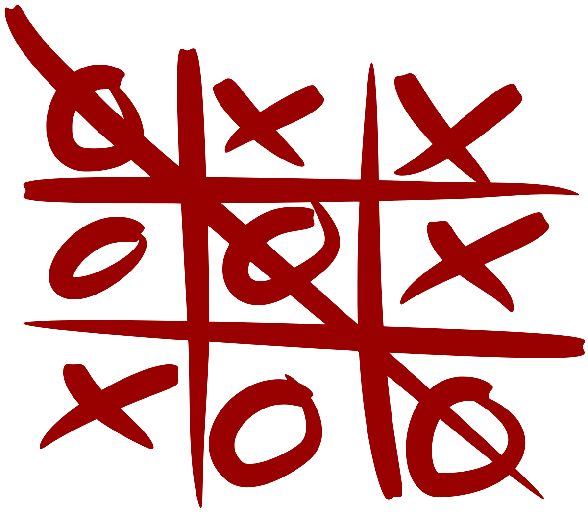

**### Make a fork or copy of this repo and fill in your team submission details! ###**

# AMD_Robotics_Hackathon_2025_Morpion

**Project goal:** This repository contains code and configuration to control a robotic arm so it can play Morpion (tic-tac-toe) on a 3×3 board during the AMD Paris 2025 hackathon.

<p align="left">
	
	
</p>

AI-assisted robotic arm that plays Morpion (tic-tac-toe) on a 3×3 board. Built as a demo for manipulation, perception and human-robot interaction during the AMD Open Robotics Hackathon 2025.

## Team Information

**Team:** Victor Gomez, Eric Huang, Ammar Moise, Leo Pouilly

**Summary:** End-to-end robotic system for playing Morpion using imitation learning for manipulation control, computer vision for board perception, and game logic for decision making. The system demonstrates pick-and-place capabilities with two SO-101 robotic arms in both human-vs-robot and robot-vs-robot modes.

## Submission Details

### 1. Mission Description
- **Real world application:** Demonstrating dexterous manipulation and game-playing capabilities of robotic arms. The system combines perception, decision-making, and precise motion control to play tic-tac-toe autonomously, showcasing practical applications in pick-and-place tasks.

### 2. Creativity
- **Novel approach:** Decomposed the problem into separate modules: imitation learning focuses on manipulation primitives (pick-and-place), while game logic is handled independently. This separation simplifies learning and allows the system to generalize across different tasks.
- **Innovation:** Two-case calibration strategy using only two reference demonstrations to infer all nine board cell positions through geometric interpolation, reducing data collection requirements.

### 3. Technical implementations
- **Teleoperation / Dataset capture**
    - Two demonstrations recorded for token placement on reference cells
    - Lead arm (5V) controlled manually, follower arm (12V) mirrors movements
    - *<Image/video of teleoperation or dataset capture>*
- **Training**
    - Neural network learns mapping from (end-effector pose + target cell pose) → (Cartesian displacement + gripper command)
    - PyTorch-based implementation with MSE loss
    - Built on top of LeRobot framework
- **Inference**
    - Real-time motion planning and execution
    - *<Image/video of inference eval>*

### 4. Ease of use
- **Generalization:** The geometric interpolation approach generalizes to any 3×3 board layout. Imitation learning primitives can adapt to variations in board position and orientation.
- **Flexibility:** System supports both human-vs-robot and robot-vs-robot play modes. Can be extended to other manipulation tasks.
- **Control interface:** Simple command-line interface with visual feedback from wrist and context cameras.

## Key features
- Play Morpion end-to-end: perception → decision → motion → placement
- Play modes: human vs robot or robot vs robot (AI)
- Geometric calibration with minimal demonstrations
- Real-time computer vision for board detection

## Requirements

This project is built on top of [LeRobot](https://github.com/huggingface/lerobot). You need it installed properly in a Python environment. Familiarity with LeRobot's dataset recording and training process is recommended.

**Make sure your LeRobot environment is activated.**

### Dependencies
- Python 3.8+
- PyTorch
- OpenCV
- LeRobot framework
- ROS (for hardware integration, optional)

## Getting started

### Clone the repository
```bash
git clone https://github.com/your-username/AMD_Robotics_Hackathon_2025_Morpion.git
cd AMD_Robotics_Hackathon_2025_Morpion
```

### Start the simulator and run the demo
```bash
# Activate LeRobot environment
source activate lerobot  # or your environment name

# Run the Morpion player
python scripts/play_morpion.py --mode simulation
```

## Quick start — real hardware

**WARNING: Ensure the workspace is clear before running on real hardware!**

1. Connect to your robot controller and verify communication
2. Set safety joint limits and zero the robot
3. Run the main player script:
   ```bash
   python scripts/play_morpion.py --mode hardware
   ```

## Important scripts

- `scripts/play_morpion.py` — main runner for simulation and hardware
- `scripts/vision.py` — OpenCV-based board detection

## Vision & perception

Use `scripts/vision.py` for board detection. The system supports:
- Background subtraction for simple setups
- Color detection for token identification
- ArUco marker grid for robust calibration
- Trained classifier for advanced scenarios

## System Overview

### Hardware Setup

**2x SO-101 Robotic Arms:**
- 1 × 5V Lead arm (teleoperator for data collection)
- 1 × 12V Follower arm (game player)

**Camera System:**
- 2 × Wrist-mounted cameras (end-effector view)
- 1 × Context camera (board overview)

### Software Modules

1. **Perception:** Board coordinate estimation from camera input
2. **Control:** Imitation learning for pick-and-place manipulation
3. **Decision:** Tic-Tac-Toe move selection logic
4. **Execution:** Real-time robot motion control

---

## Imitation Learning Approach

### Why Imitation Learning?

We do not learn the full game strategy through imitation. Instead, imitation learning focuses on **robot manipulation primitives**, while game logic is handled separately.

**Key benefits:**
- **Behavior cloning:** Direct learning from human demonstrations
- **Task decomposition:** Separates control from game strategy
- **Sample efficiency:** Minimal data required for meaningful learning

---

## Data Collection

**2-Case Demonstration Strategy:**

Two demonstrations are recorded for token placement on two reference cells of the board. These serve as calibration points that define the board's coordinate system, allowing the robot to infer the positions of all nine cells through geometric interpolation.

---

## Model & Training

**Neural Network Architecture:**
- **Input:** End-effector pose + target cell pose
- **Output:** Cartesian displacement + gripper command
- **Loss function:** Mean Squared Error (MSE)
- **Framework:** PyTorch with LeRobot

**Training pipeline:**
- Data preprocessing and normalization
- Model training with validation
- Weights and Biases (W&B) integration for experiment tracking

---

## Experimental Results

- **Success rate:** _(to be filled with results)_
- **Qualitative observations:** _(video/photo documentation)_
- **Inference time:** _(ms per move)_

---

## Limitations & Future Work

### Current Limitations
- Board detection requires manual calibration in some scenarios
- Limited training demonstrations (2 reference cases)
- Assumes static board setup

### Future Improvements
- Implement fully automated board detection via computer vision
- Expand dataset with more diverse demonstrations
- Add dynamic board tracking for moving targets
- Optimize gripper control for different token types
- Extend to other game boards and manipulation tasks

## Contributing

We welcome contributions! Please feel free to submit issues and enhancement requests.

## Additional Links

- **Demo video:** [Watch the demo video](https://youtube.com/your-demo-link)
- **Dataset:** [URL of your dataset in Hugging Face](https://huggingface.co/)
- **Model:** [URL of your model in Hugging Face](https://huggingface.co/)
- **Blog post:** [Link to blog post describing your work](#)

## Code submission

This is the directory tree of this repo, you need to fill in the `mission` directory with your submission details.

```terminal
AMD_Robotics_Hackathon_2025_ProjectTemplate-main/
├── README.md
└── mission
    ├── code
    │   └── <code and script>
    └── wandb
        └── <latest run directory copied from wandb of your training job>
```


The `latest-run` is generated by wandb for your training job. Please copy it into the wandb sub directory of you Hackathon Repo.

The whole dir of `latest-run` will look like below:

```terminal
$ tree outputs/train/smolvla_so101_2cube_30k_steps/wandb/
outputs/train/smolvla_so101_2cube_30k_steps/wandb/
├── debug-internal.log -> run-20251029_063411-tz1cpo59/logs/debug-internal.log
├── debug.log -> run-20251029_063411-tz1cpo59/logs/debug.log
├── latest-run -> run-20251029_063411-tz1cpo59
└── run-20251029_063411-tz1cpo59
    ├── files
    │   ├── config.yaml
    │   ├── output.log
    │   ├── requirements.txt
    │   ├── wandb-metadata.json
    │   └── wandb-summary.json
    ├── logs
    │   ├── debug-core.log -> /dataset/.cache/wandb/logs/core-debug-20251029_063411.log
    │   ├── debug-internal.log
    │   └── debug.log
    ├── run-tz1cpo59.wandb
    └── tmp
        └── code
```

**NOTES**

1. The `latest-run` is the soft link, please make sure to copy the real target directory it linked with all sub dirs and files.
2. Only provide (upload) the wandb of your last success pre-trained model for the Mission.