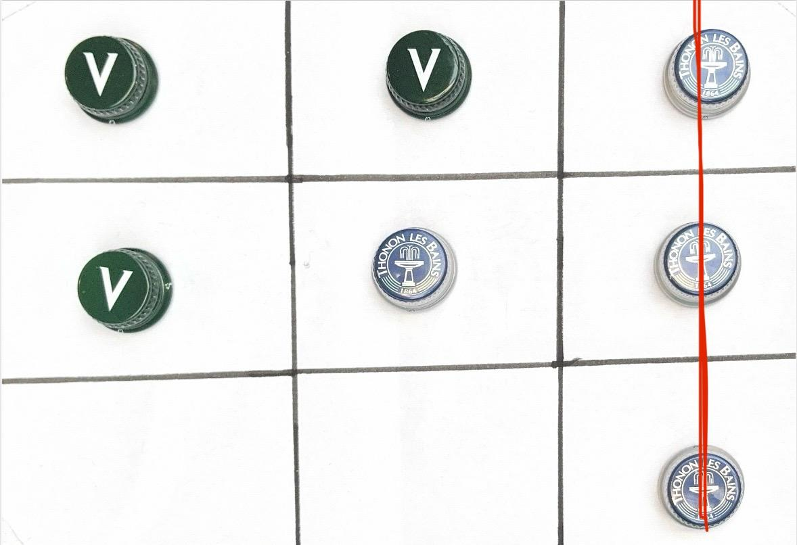

## Morpion Robot – AMD Robotics Hackathon 2025

This repo contains our code and configs to control a SO-101 robotic arm that plays Morpion (tic‑tac‑toe) on a 3×3 board during the AMD Paris 2025 hackathon.

The idea is simple: you put tokens on a real board, the robot “sees” the game, chooses a move, and places its own token.

<p align="left">
  
</p>

---

## Team

- Victor Gomez  
- Eric Huang  
- Ammar Moise  
- Leo Pouilly  

We built this as a small end‑to‑end robotics project: perception → decision → motion.

---

## What this project does

- **Play Morpion on a real 3×3 board**
  - Detect the board and tokens with a camera.
  - Decide the next move with simple game logic (no deep RL).
  - Control a SO‑101 arm to pick and place tokens.
- **Two modes**
  - Human vs robot  
  - (Optional) Robot vs robot if you run two arms.

Under the hood we use imitation learning for low‑level manipulation (reach → grasp → place), and keep the game logic separate and simple.

---

## How it works (high level)

- **Perception**
  - One or more cameras look at the board.
  - A small vision module estimates the 3×3 grid and who played where.
- **Control**
  - A learned policy takes as input the end‑effector pose and the target cell.
  - It outputs a Cartesian displacement and a gripper command.
- **Decision**
  - Basic tic‑tac‑toe rules: try to win, otherwise block, otherwise play a free cell.
- **Execution**
  - The arm executes a pick‑and‑place motion to the chosen cell.

We rely on [LeRobot](https://github.com/huggingface/lerobot) for dataset handling, training and deployment.

---

## Requirements

- Python 3.8+
- PyTorch
- OpenCV
- LeRobot
- (Optional) ROS for SO‑101 hardware integration

Make sure your LeRobot environment is activated before running anything.

---

## Quick setup

```bash
git clone https://github.com/ammarmoise0/Tic_Tac_Toe_Robot.git
cd Tic_Tac_Toe_Robot

# activate your LeRobot / Python env
source activate lerobot  # or: conda activate <env>
```

---

## Run in simulation

```bash
python scripts/play_morpion.py --mode simulation
```

This simulates the robot and scene to quickly test the perception → decision → control pipeline without risking the real arm.

---

## Run on real hardware

> ⚠️ **Safety first**: clear the robot workspace and make sure you can cut power quickly.

1. Connect to the robot controller and check communication.  
2. Set joint limits and home the robot.  
3. Start:

```bash
python scripts/play_morpion.py --mode hardware
```

The scripts assume you already calibrated the table and board.

---

## Important files

- `scripts/play_morpion.py` – main entry point (simulation + hardware).  
- `scripts/vision.py` – board and token detection.  
- `mission/code/` – mission‑specific code (imitation learning, training, etc.).  
- `mission/wandb/` – last W&B run associated with the model used in the demo.  

---

## Vision & perception

The `scripts/vision.py` module is intentionally kept simple so you can adapt it easily:

- detect the 3×3 board,  
- detect tokens / played cells,  
- expose a clean 3×3 game state to the rest of the system.  

You can change the method (background subtraction, color detection, ArUco, small learned model, …) depending on your setup.

---

## Data & training (short version)

For manipulation we use imitation learning:

- a few teleoperated demos (placing tokens on reference cells),  
- a network that outputs end‑effector displacement + gripper command,  
- training with MSE on trajectories using LeRobot + PyTorch,  
- experiment tracking with Weights & Biases.  

More details live in `mission/code/` and in the W&B run stored in `mission/wandb/`.

---

## Current limitations

- Board calibration is still a bit manual.  
- Few demonstrations → the behavior is limited to what we showed it.  
- We assume a fixed board, well framed in the camera field of view.  

Obvious next steps:

- more robust and automatic board detection,  
- more varied demonstrations and scenarios,  
- better collision handling and grasping of different tokens.  

---

## Contributing

This repo is mainly educational.  
If you adapt it to other robots, cameras or board setups, feel free to open issues or PRs to share your changes.


